<p align="center">
  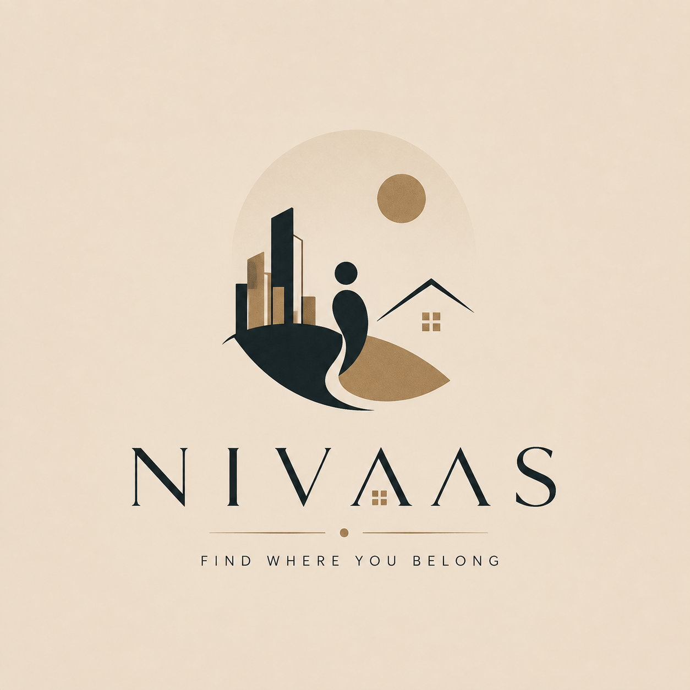
</p>

<h1 align="center">NIVAAS</h1>
<p align="center"><strong>Bangalore Livability Intelligence Platform</strong></p>
<p align="center">🚀 <strong>Live Application:</strong> <https://nivaas-nivaas1.vercel.app></p>
<p align="center">An urban intelligence platform that combines locality analytics, recommendation systems, and geospatial intelligence to help users discover the most suitable neighborhoods in Bangalore.</p>

---

## Demo

| Resource | Link |
|---|---|
| Live Application | <https://nivaas-nivaas1.vercel.app> |
| Frontend Walkthrough | [Download Demo Video](docs/video/nivaas_frontend_demo.mp4) |

---

## Table of Contents

- [Problem Statement](#problem-statement)
- [Overview](#overview)
- [Dataset Scale](#dataset-scale)
- [User Journey](#user-journey)
- [Recommendation Engine](#recommendation-engine)
- [Locality Intelligence Features](#locality-intelligence-features)
- [System Architecture](#system-architecture)
- [Database Design](#database-design)
- [Technology Stack](#technology-stack)
- [Project Structure](#project-structure)
- [Getting Started](#getting-started)
- [Roadmap](#roadmap)
- [Author](#author)

---

## Problem Statement

Choosing where to live in Bangalore means balancing multiple factors: rent affordability, locality convenience, access to everyday amenities, and neighborhood characteristics. Listing portals allow users to filter properties, but they provide limited support for comparing entire localities across these dimensions.

NIVAAS treats this as a ranking problem rather than a search problem: given a user's preferences and constraints, which localities are the best fit, and why?

## Overview

NIVAAS is designed as a data-driven recommendation platform where intelligence resides in engineered locality features, geospatial analytics, and ranking algorithms rather than LLM prompts. The conversational assistant acts as an interaction layer over the same recommendation engine.

- **Locality Intelligence Layer** — structured data on properties, listings, and spatially referenced locality data, standardized into comparable per-locality metrics.
- **Recommendation Engine** — converts a user's stated constraints into a feature-based query and ranks localities by fit.
- **Geospatial Analytics** — PostGIS-backed spatial processing and locality intelligence features built from spatially referenced property and locality data.

**Niv Assistant**, the conversational interface, sits on top of these components as an interaction layer. It is not the recommendation logic — it is a UI convenience over the same engine described below.

NIVAAS is positioned as a recommendation system, geospatial analytics platform, and urban intelligence product rather than a chatbot-centric application.
The platform follows a feature-engineering-first architecture where locality intelligence is computed offline and consumed by the recommendation engine through precomputed feature stores.

## Dataset Scale

| Entity | Volume |
|---|---|
| Properties | 460+ |
| Listings | 500+ |
| Localities | 1,122+ |
| Metro Stations | 128+ |
| Engineered Locality Features | 8+ |

## User Journey

The recommendation flow is a guided questionnaire rather than a search bar — the inputs required for a meaningful ranking (budget, commute origin, lifestyle weighting) are structured and multi-dimensional, which a single search field can't capture reliably.

<p align="center">
  
</p>

The user starts on the landing page, then moves into a short onboarding step before the questionnaire begins.

<p align="center">
  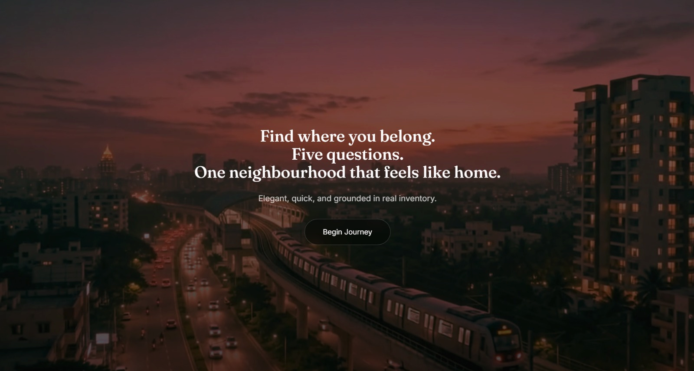
  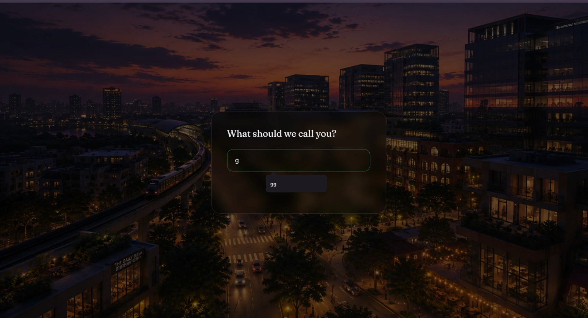
</p>

The questionnaire itself is split into focused steps — budget, commute, lifestyle, and preferences — rather than one long form, so each constraint is captured deliberately.

<p align="center">
  
  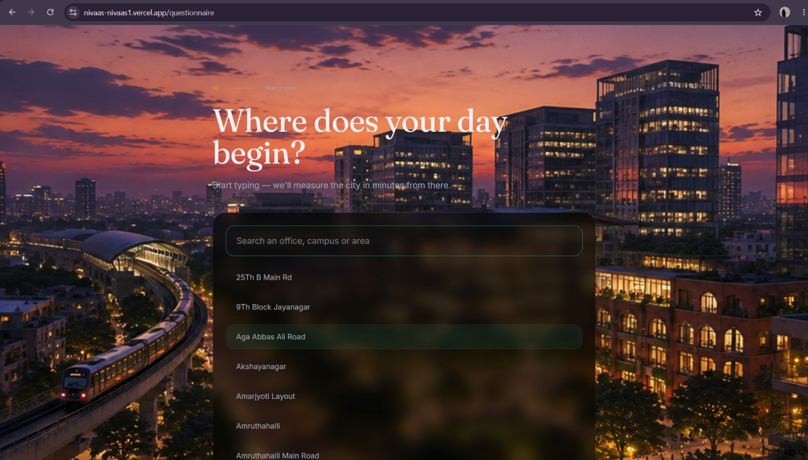
</p>
<p align="center">
  
  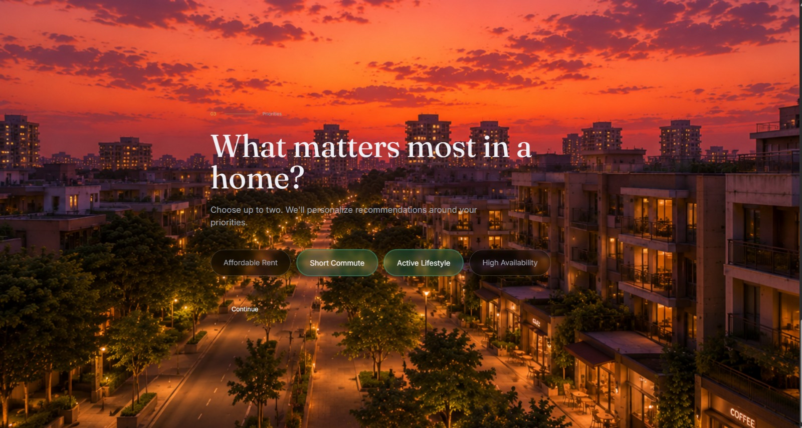
</p>

Once submitted, the constraint set is sent to the recommendation engine.

<p align="center">
  
  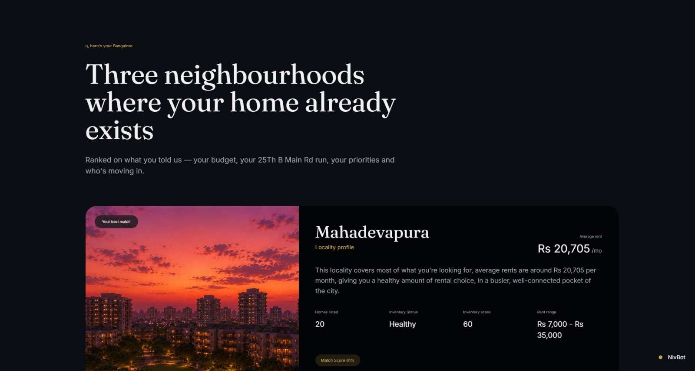
</p>

Results are split between top matches and the remaining ranked candidates, so the strongest fits aren't buried in a long list.

<p align="center">
  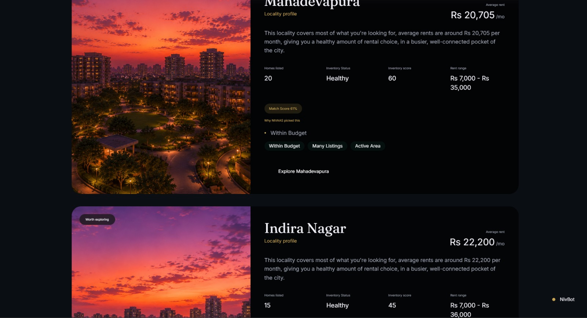
  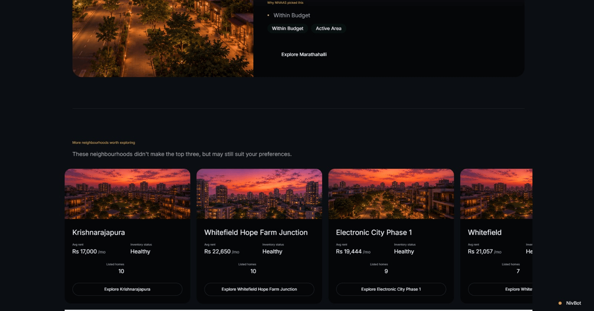
</p>

Each locality can be inspected in detail — its score breakdown and the amenities driving that score.

<p align="center">
  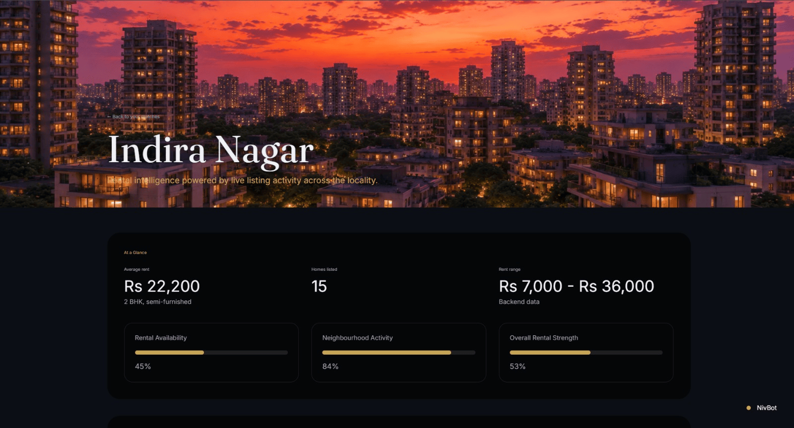
  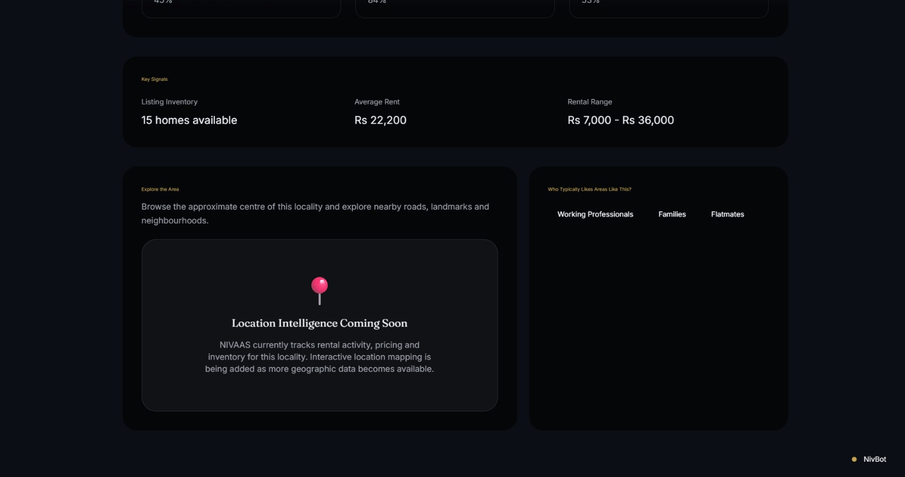
</p>

Niv Assistant is available throughout for follow-up questions against the same underlying data.

<p align="center">
  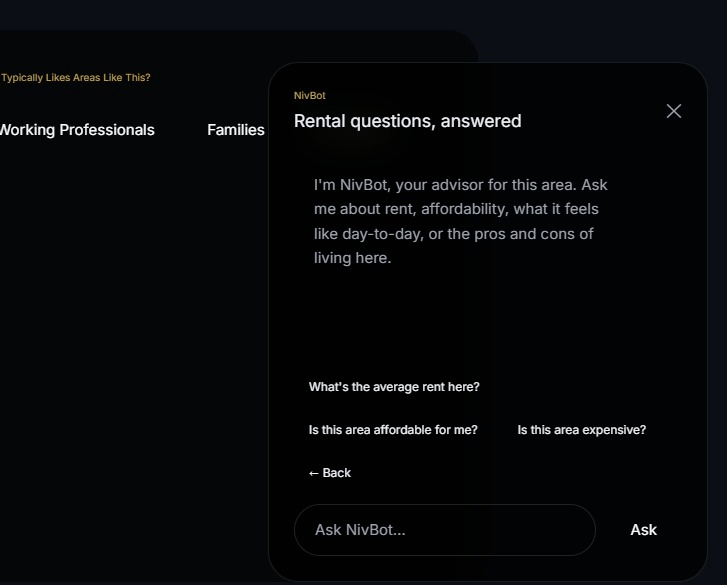
</p>

## Recommendation Engine

<p align="center">
  <a href="docs/images/recommendation-pipeline.svg">
    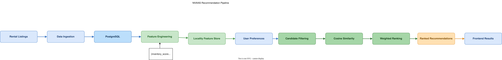
  </a>
</p>
<p align="center">
  Click image to open full-size SVG
</p>

The pipeline runs in five stages:

1. **Candidate Retrieval** — localities are narrowed down using hard constraints (budget range, inventory availability) before any scoring happens, keeping the candidate set bounded.
2. **Feature Extraction** — each candidate locality's stored feature vector (rent statistics, inventory metrics and density metrics) is pulled from the feature store.
3. **Scoring** — candidates are scored against the user's stated weighting across the recommendation dimensions.
4. **Similarity Ranking** — the user's constraint vector is compared against each candidate locality's feature vector using cosine similarity (scikit-learn), producing a ranked order.
5. **Result Assembly** — per-dimension sub-scores are returned alongside the final rank, so a result can be inspected rather than treated as a single opaque number.

Feature vectors and similarity computation are built with **NumPy** and **scikit-learn**; there is no deep learning or predictive modeling in the current pipeline — ranking is a similarity computation over engineered features, not a trained model.

## Locality Intelligence Features

NIVAAS stores precomputed locality-level features inside the feature store and uses them during recommendation generation.

Current production features include:

- Inventory Score
- Density Score
- Overall Score
- Average Rent
- Minimum Rent
- Maximum Rent
- Listing Count
- Property Count

Feature engineering jobs compute these values offline and persist them in PostgreSQL. The recommendation engine consumes the precomputed feature vectors at query time rather than performing expensive calculations per request.


## System Architecture

<p align="center">
  <a href="docs/images/system-architecture.svg">
    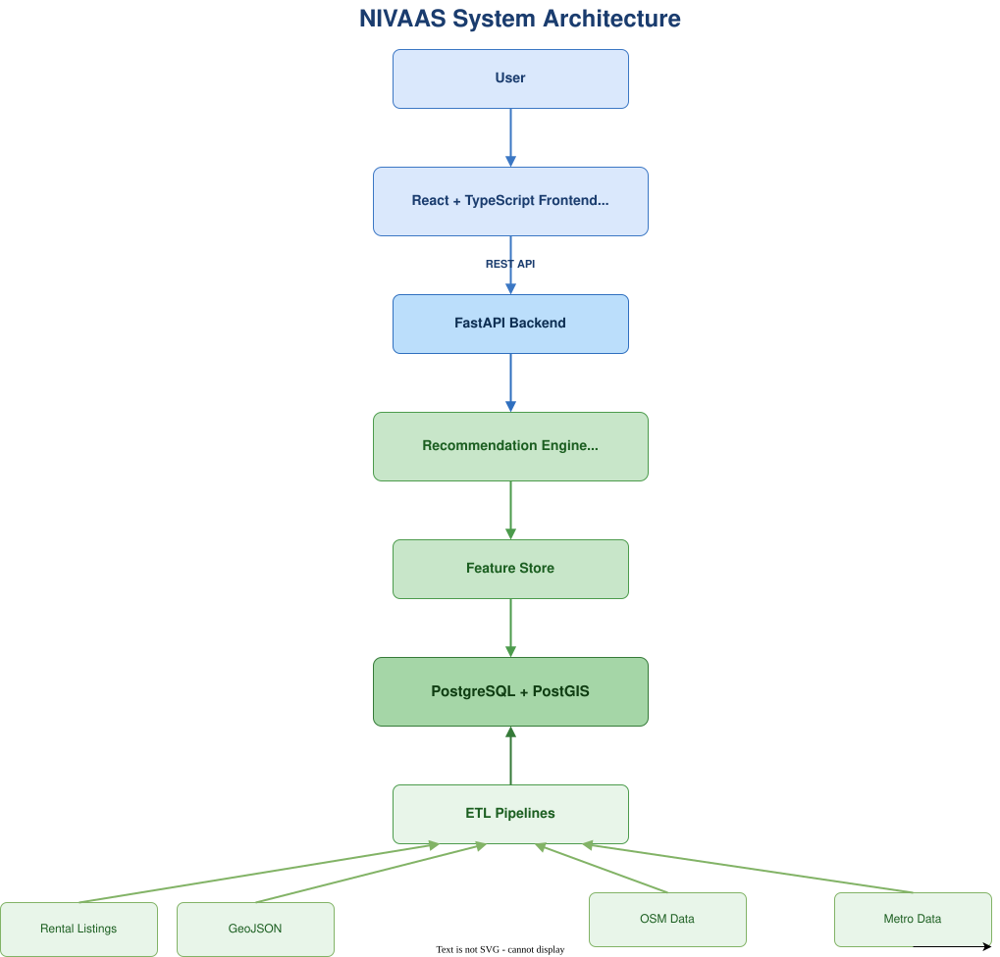
  </a>
</p>
<p align="center">
  Click image to open full-size SVG
</p>

- **React + TypeScript + TanStack Router + Vite** power the frontend experience.
- **FastAPI** serves recommendation, locality intelligence, and geospatial APIs.
- **Supabase PostgreSQL + PostGIS** store locality, property, listing, and spatial data used to generate locality intelligence features.
- **Supabase** provides managed PostgreSQL infrastructure, authentication-ready APIs, and database management capabilities.
- **Feature Store Tables** hold precomputed locality intelligence metrics used during recommendation.
- **Render** hosts and deploys backend API services.
- **Vercel** hosts and deploys the production frontend application.
- **Docker** provides a reproducible local development environment.
- **GitHub** manages source control and project collaboration.

## Database Design

<p align="center">
  <a href="docs/images/erd.svg">
    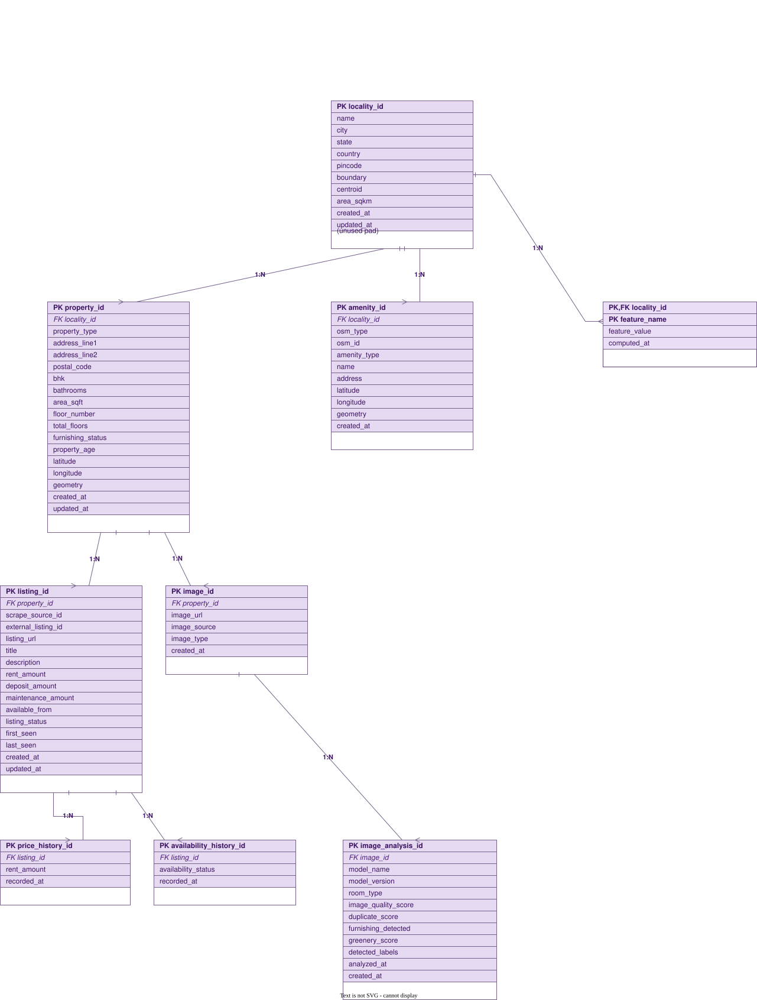
  </a>
</p>
<p align="center">
  Click image to open full-size SVG
</p>

The schema is organized around **Localities** as the aggregation root.Properties and listings are linked to localities through a normalized relational model. PostGIS geometry columns enable spatial indexing, locality boundary storage, centroid calculations and future geospatial feature engineering workflows.

## Technology Stack

| Layer | Technologies |
|---|---|
| Frontend | React, TypeScript, Vite, TailwindCSS, TanStack Router |
| Backend | FastAPI, Python |
| Database | Supabase PostgreSQL, PostGIS |
| Data & Analytics | NumPy, scikit-learn |
| Recommendation Engine | Cosine Similarity, Feature-Based Ranking |
| State Management | Zustand |
| API Layer | Axios |
| Deployment | Vercel, Render |
| Infrastructure | Docker, GitHub |

## Project Structure

```text
NIVAAS-V1/
│
├── backend/
│   └── app/

├── frontend/
│   └── nivaas-frontend/
│       ├── src/
│       ├── public/
│       └── package.json

├── data/
├── db/
├── docs/
├── elt/
├── tests/
├── docker-compose.yml
└── README.md
```

## Getting Started

**Prerequisites:** Python 3.11+, Node.js 18+, Docker.

```bash
# Clone
git clone https://github.com/zmuskan/NIVAAS-V1.git
cd NIVAAS-V1

# Start PostgreSQL + PostGIS
docker compose up -d db

# Backend
cd backend
python -m venv venv
source venv/bin/activate
pip install -r requirements.txt
uvicorn app.main:app --reload --port 8000

# Frontend
cd ../frontend/nivaas-frontend
npm install
cp .env.example .env      # set VITE_API_BASE_URL
npm run dev
```

Backend API docs: `http://localhost:8000/docs`
Frontend: `http://localhost:5173`

## Roadmap

- Formal evaluation of recommendation quality (currently validated by manual review, not an automated metric).
- Incorporate user feedback on recommendations as a future input to locality scoring.
- Expand geospatial accessibility coverage with additional spatial data sources.

## Author

**Zaiba Muskan**

- GitHub: https://github.com/zmuskan
- Project Repository: https://github.com/zmuskan/NIVAAS-V1
- Live Application: https://nivaas-nivaas1.vercel.app
